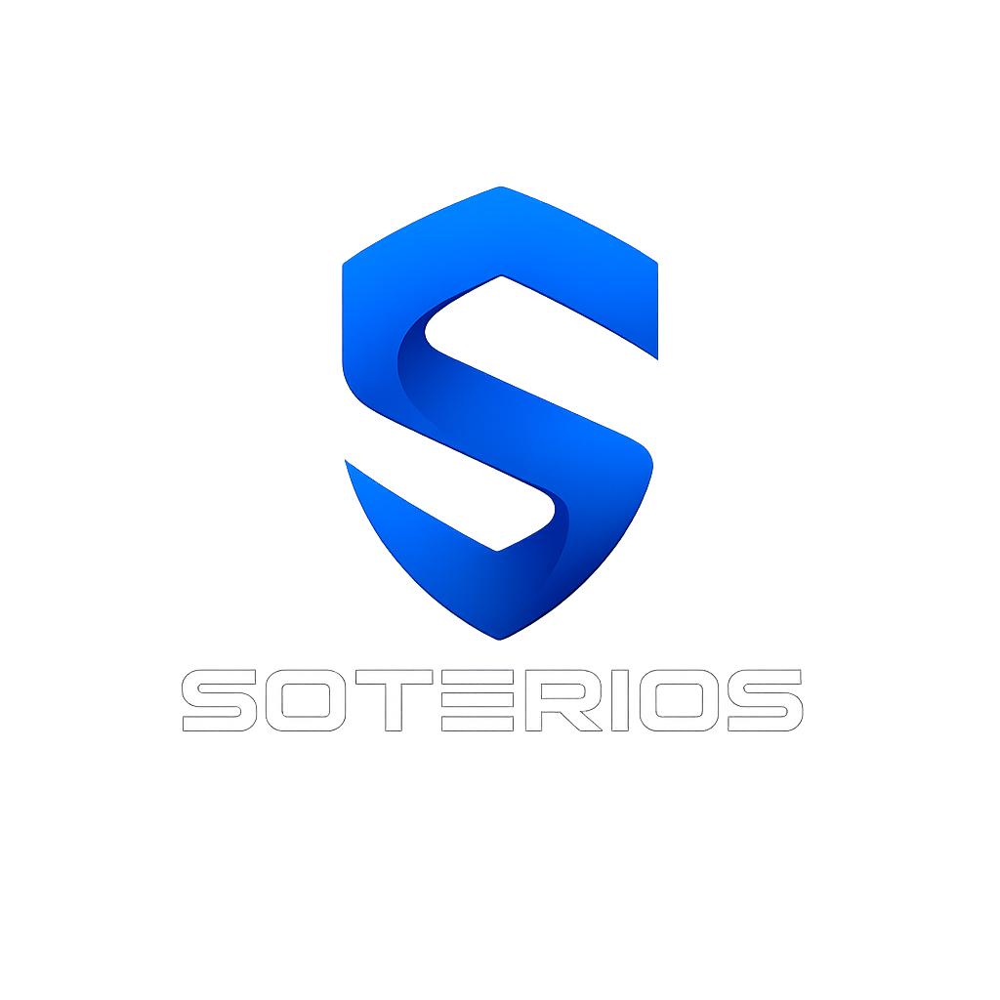

<p align="center">

</p>

<p align="center">
<strong>Open-source, local-first security and system maintenance suite built for Windows.</strong><br/>
Scan files, inspect processes, audit your system, manage your firewall, test password strength, and check known breaches privately.
</p>

<p align="center">
<a href="https://github.com/chrisriv10/Soterios/releases/latest"></a>
<a href="https://github.com/chrisriv10/Soterios/blob/main/build/LICENSE.txt"></a>
<a href="https://github.com/chrisriv10/Soterios/releases/latest"></a>
</p>

---

## Changelog

See [CHANGELOG.md](CHANGELOG.md) for a full history of notable changes and release notes.

---

## Download & Install

Soterios is currently available for **Windows**. The project is focused on providing the best possible Windows experience first, as many security and maintenance features rely on Windows-specific APIs, services, and system integrations.

Support for **macOS and Linux may come in future releases** as the project evolves. Expanding to additional platforms requires adapting features to each operating system's security model while maintaining the reliability and privacy-first approach of Soterios.

Download the latest Windows release:

| Platform | Installer | Notes |
|----------|-----------|-------|
| **Windows** | `Soterios-Setup-1.3.0.exe` | NSIS installer · requires admin for system-level checks |

The release build also produces `soterios-extension-2.0.0.zip`, a Chromium Manifest V3 package for sideloading or store submission. The extension is included in the desktop installer resources and can also be built independently (see [Build Installers](#build-installers)).

---

## Features

- **First-Run Setup Wizard** — theme, language, real-time protection, notifications, privacy mode, and browser extension install in one guided flow; replay it anytime from Settings
- **Security Dashboard** — health score, scan status, warnings, ignored warnings, quarantine count, and real-time protection controls, plus a tray dashboard for at-a-glance status
- **Malware Scan** — quick, full, and custom scans powered by ClamAV with definition updates, live progress metrics, cancellation, quarantine, and saved reports (PDF/CSV export)
- **Process Inspector** — native Rust-backed inspector with risk scoring, Task Manager-style context menu, and detection for Office/PDF-spawned script hosts and processes with an unexpected parent
- **Reports** — browse, view, generate, and delete scan and system reports in-app
- **Windows Security Audit** — Defender, UAC, Windows Update, BitLocker, PowerShell policy, and Secure Boot, with per-section management actions
- **Firewall Management** — profile status, rule summaries, multi-select bulk rule actions, and an endpoint activity radar visualizing live connections
- **Network Monitor** — active connections, interface activity, an adaptive geo activity map, and selectable traffic history ranges
- **VPN Management** — on/off control, tray toggle, auto-connect, guided provider setup, and removal of Soterios-created profiles
- **Credential Safety Hub** — local password generator, strength checker, HIBP k-anonymity password leak checks, and XposedOrNot email breach checks
- **Browser Extension 2.0** — local password reuse detection, breach/reuse toolbar badge, Google Safe Browsing phishing/malware warnings, a signed threat feed, matching themes, and optional continuous protection for HTTP/HTTPS sites
- **AI Assistant** — local Ollama integration with system context awareness and the ability to run safe Soterios actions on request
- **Real-Time Protection** — toggles Windows Defender real-time monitoring on/off and verifies its state
- **Privacy Mode** — one Settings toggle that disables Soterios's data-sharing and history features (external breach/geo lookups, AI assistant context, traffic and scan history, auto reports) and restores them when turned off
- **Quarantine Management** — restore or permanently delete isolated files, with status history and safe recovery controls
- **Maintenance Scheduler** — configurable auto-clean policies with per-script settings, run-now overrides, and a Safety Vault that stages files before deletion instead of removing them immediately
- **Device Optimization** — switch power plan modes to trade performance for battery life or vice versa
- **Tools & Maintenance** — temp file cleanup, disk reports, large file finder, duplicate file finder, secure file shredder, folder watch, network alerts, browser cache reports, startup items and persistence monitoring, network reports, Windows services reports, scheduled tasks reports, hosts file integrity checks, and network interface/connection reports
- **Software Uninstaller** — locate and remove installed applications, including leftover files

---

## Screenshots

UI screenshots are **not committed to the repo**. For visual verification, see the **Visual verification** section in [PR #82](https://github.com/chrisriv10/Soterios/pull/82).

To capture for a future PR: run `npm run capture:screenshots` (or `npm start` manually) and attach PNGs to the PR (see [tests/fixtures/screenshots/README.md](tests/fixtures/screenshots/README.md)).

---

## Privacy

Soterios does **not** collect telemetry or analytics. All scanning and system analysis happens locally on your machine. Network calls occur **only** when a feature that needs them is active (ClamAV updates, HIBP checks, XposedOrNot lookups, browser extension Safe Browsing checks and threat feed updates).

**Privacy Mode**, available from Settings, disables every external lookup and history/data-sharing feature (breach/geo lookups, AI assistant context, traffic and scan history, auto reports) with a single toggle, and locks those settings until you turn it back off. The browser extension has its own equivalent Privacy Mode toggle in its options page, which disables its third-party calls (HIBP, Safe Browsing) independently of the desktop app — local-only features like password reuse detection keep working either way, since that data never leaves your device.

---

## Development Setup

### Prerequisites

- [Node.js](https://nodejs.org/) 26 or newer (required by the package engine)
- [Git](https://git-scm.com/)

### Clone & Run

```bash
git clone https://github.com/chrisriv10/Soterios.git
cd Soterios
npm install
npm start
```

### Build Installers

```bash
# Windows (NSIS .exe)
npm run dist:win
```

To build and package the Chromium extension separately:

```bash
npm run extension:build
npm run extension:validate
npm run extension:package
```

Built artifacts are output to the `dist/` directory.

### Environment Variables

| Variable | Description |
|----------|-------------|
| `SOTERIOS_DISABLE_GPU=1` | Setting this will disable GPU acceleration (which is enabled by default), to force full software rendering. Set this if rendering glitches or crashes occur related to GPU drivers.
| `SOTERIOS_USERDATA=<path>` | Allows for specifying a custom path to override the default user data directory (%APPDATA%\Soterios). This may be useful for running isolating instances to retain results.

In order to utilize these environment variables during runtime, the start command can be modified as followed: `set SOTERIOS_DISABLE_GPU=1 && npm start`.

---

## API Notes

| Feature | Service | Privacy |
|---------|---------|---------|
| Password leak checks | [Have I Been Pwned – Pwned Passwords](https://haveibeenpwned.com/Passwords) | Only the first 5 characters of the SHA-1 hash are sent (k-anonymity); the browser extension never sends your plaintext password to the desktop app either |
| Email breach checks | [XposedOrNot](https://xposedornot.com/) | Free public email breach API |
| Browser extension phishing/malware warnings | [Google Safe Browsing v5](https://developers.google.com/safe-browsing) | Only checks the current page's URL; results are cached in-session to reduce lookups |
| Browser extension threat feed | CERT Polska + URLhaus | Signed feed of known-malicious domains, fetched independently of your browsing activity |

All of the above are gated behind **Privacy Mode**, which disables every external lookup with one toggle (see Features above).

---

## Project Structure

```text
main.js Electron root entry point
src/preload/ contextBridge API exposed to the renderer
src/main/ IPC handlers, ServiceRegistry, and app/service orchestration
src/core/ database, event bus, tool registry, plugin loader
src/security/ scanning, quarantine, audit, firewall, network, process, and realtime services
src/tools/ built-in tool modules
src/scripts/ safe script modules and registry (maintenance, cleanup, reports)
src/ui/ shell, CSS, shared JS, and page modules
native/ Rust process-inspector helper binary
browser-extension/ Soterios browser extension (Manifest V3)
assets/ Soterios icons and bundled ClamAV files
tools/ build and install helpers (ClamAV download, extension packaging)
tests/ unit tests, smoke checks, and validation fixtures
build/ installer resources
```

---

## Roadmap

These features are planned for future updates. There is no fixed release order. Features will be released as they are completed.

## Planned Features

### Security
- USB device scanning
- Secure local credential vault

### Monitoring
- CPU/GPU temperature monitoring
- Disk SMART monitoring and alerts
- Process history
- Startup impact analysis

### Maintenance
- Startup manager
- System Restore manager
- Additional cleanup and optimization tools

### Interface
- UI polish

### Future Considerations

These are longer-term ideas that may require significant architectural work:

- Custom real-time protection
- Proprietary scanning engine
- Cross-platform support (macOS/Linux)

*Order and scope may change based on feedback. Releases have no fixed dates*

---

## Contributing

Contributions are welcome! To get started:

1. **Fork** the repository.
2. **Create a branch** for your feature or fix: `git checkout -b feature/my-feature`.
3. **Commit** your changes with clear messages.
4. **Push** to your fork and open a **Pull Request**.

Please make sure your changes work locally (`npm start`) before submitting.

**Documentation:** User and developer guides live in [`docs/wiki/`](docs/wiki/Home.md) and on the [GitHub Wiki](https://github.com/chrisriv10/Soterios/wiki).

---

## Project Status & Contributions

Soterios is actively developed and continuing to mature.

The project is functional and usable, but some features are still being refined and additional improvements are planned for future releases.

Because of this, feedback and contributions are especially valuable.

### Areas that need help

- Stabilizing and improving the malware scanning system
- Expanding and refining system audit coverage
- Improving UI consistency and user experience
- Performance optimization across system monitoring tools
- Strengthening overall architecture and modularity
- Identifying and fixing bugs

### How you can contribute

If you're interested in system tools, security software, or Electron-based applications, contributions, testing, and feedback are welcome as the project grows.

Even small improvements, bug reports, or suggestions are appreciated.

## License

Soterios is released under the [MIT License](build/LICENSE.txt).

**Copyright © 2026 Christopher Rivera**
